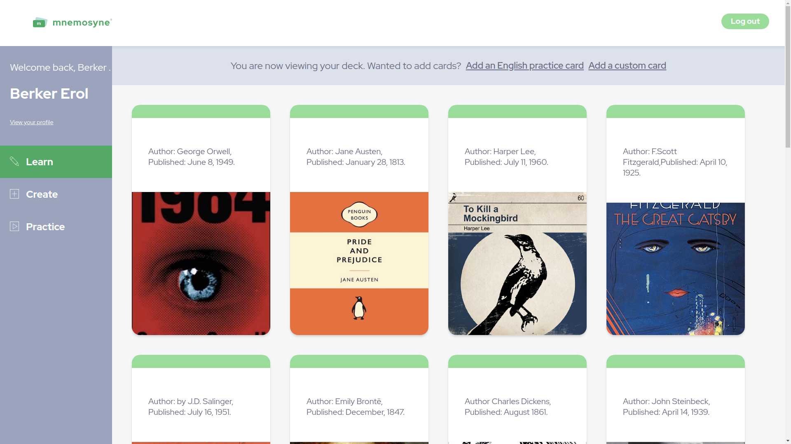

# Mnemosyne
Flash card application that lets a user learn and memorize any subject. The user can create custom cards with animated pictures, or create English cards where a dictionary definition and a related visual are fetched automatically. The user can then practice their decks in the game mode.

This is a final project done in the Lighthouse Labs Web Development Bootcamp by Berker Erol & Julie Duong.

Built with React (hooks), JavaScript, Knex, Express, Node.js, CSS3, HTML5, & Figma. Uses the Merriam-Webster dictionary API, and the Unsplash photo API.

## Screenshots

### Landing page

### Login page

### Signup page

### Decks in Learn Mode

### Book cards

### Cocktail cards

### Creating cards

### Soccer Deck in Practice

## Setup
1. Create the `.env` file by copying the `.env.example`.
2. Install dependencies in both the backend and client folders: `npm install`
3. In the backend folder (in vagrant), run `createdb mnemosyne -O labber`, `knex migrate:latest`, and `knex seed:run` to set up the database.
4. Run the backend with `npm run dev`.
5. In the client folder, run the front end with `npm start`.
6. Visit `http://localhost:3000/`
